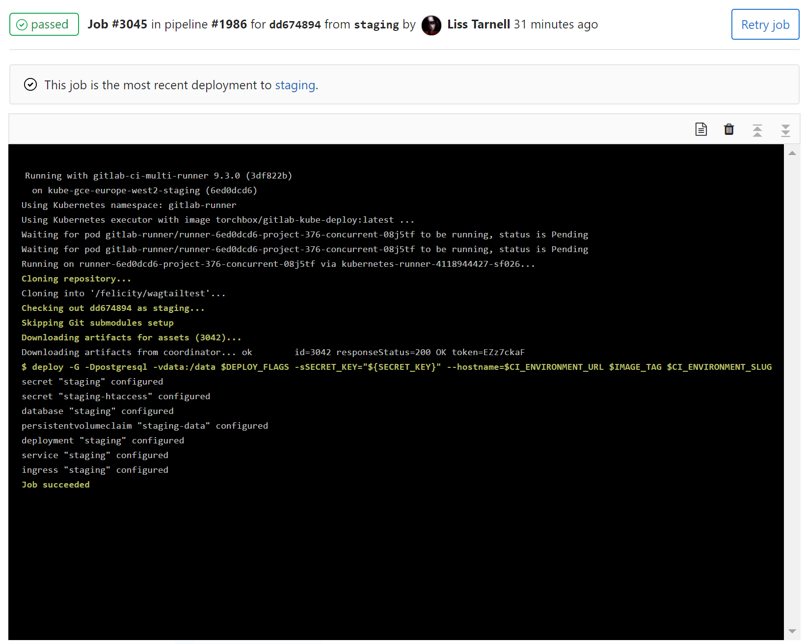

# Kubernetes deployment tool

Note: Prior to version 1.8.0-1, kdtool was known as gitlab-kube-deploy.  It has
been renamed as its scope has expanded and it's no longer specific to GitLab.

kdtool is a utility for deploying applications and interacting with deployed
applications on Kubernetes, with an emphasis on deploying from GitLab and other
CI applications.  It can be installed and used standalone from the command
line, or as a container image in Docker-based CI workflows.

kdtool can deploy simple applications without needing a manifest.  Based on
command-line options, it can provision Deployments, Service and Ingresses,
and configure environment variables (via Secrets or ConfigMaps), persistent
volumes and databases (with an
[external database controller](https://github.com/torchbox/k8s-database-controller/)),
as well as ACME/Let's Encrypt TLS certificates (with
[kube-lego](https://github.com/jetstack/kube-lego)) and HTTP authentication.

For more complicated applications, kdtool can simplify YAML (or JSON)
manifests, providing environment-based template variable substitution to deploy
several different copies of an application (for example, a staging site and any
number of review apps) from a single manifest.  When deploying from CI, you can
substitute `$IMAGE` in the manifest to easily deploy the image that was built.

Even if you don't use kdtool to deploy your application, its `shell` command
makes it easier to interact with running applications, e.g. to debug problems,
copy files from to or from the application, or connect to the application's
database.  kdtool can start a shell (or any other command) using the same
image, environment variables, volume mounts, and other configuration as any
existing deployment, using a single command.

kdtool's `status` command provides an overview of a Deployment, its ReplicaSets
and their pods, to make problems with deployments easier to diagnose without
having to examine each pod or ReplicaSet individually.

## Screenshot

Use it from GitLab CI:



Or from the command line:

```
% kdtool deploy -H testapp.example.com --port=8080 gcr.io/google_containers/echoserver:1.4 testapp
deployment "testapp" created
service "testapp" created
ingress "testapp" created
% curl -sSi http://testapp.example.com
HTTP/1.1 200 OK
...
```

## Installation

Download `kdtool.pyz` from the latest release and copy it to a convenient
location, such as `/usr/local/bin/kdtool`.  This is a Python zipapp and requires
Python 3.4 or later to run.

To use `kdtool deploy`, you must have `kubectl` installed.  If you have an
existing kubeconfig file (e.g. `$HOME/.kube/config`, or specified in
`$KUBECONFIG`), kdtool will take configuration from there by default.

Or, build from source:

```
% make dist
% ./kdtool.pyz -h
```

Or, run from the Docker image:

```
% docker run --rm -ti torchbox/kdtool:latest -h
```

You don't need to install anything to use kdtool from GitLab CI; just specify
the Docker image in the job.

## Using with GitLab CI

Since GitLab 9.4, no additional configuration is required for use with GitLab.
Use the Docker image `torchbox/kdtool:latest` in your CI job and invoke
`kdtool deploy ...` as normal.

Prior to GitLab 9.4, you must use `kdtool --gitlab deploy ...` to pick up the
authentication configuration.

Either way, kdtool requires that you have
[set up Kubernetes integration](https://docs.gitlab.com/ce/user/project/integrations/kubernetes.html)
for your GitLab project.

## General options

These options affect the overall behaviour of kdtool and how it connects to
your Kubernetes cluster.  If you already have a working kubeconfig (e.g. for
kubectl), you won't normally need any of these options except `--namespace`.

* `-n ns, --namespace=ns`: Set the Kubernetes namespace to operate in. Default:
  `default`.
* `-c ctx, --context=ctx`: Set the cluster context to use; the context must
  exist in the loaded kubeconfig file.
* `-K path, --kubectl=path`: Specify the location of `kubectl` (default:
  autodetect).
* `-G, --gitlab`: Take Kubernetes cluster details from GitLab environment
 variables.  (Replaces `--namespace`, `--server`, `--ca-certificate` and
 `--token`; unnecessary since GitLab 9.4.)
* `-S url, --server=url`: Set the URL of the Kubernetes API server (default:
  `http://localhost:8080`).
* `-T token, --token=token`: Set Kubernetes authentication token.  This can be a
  user token, a serviceaccount JWT token or whatever.  No default.
* `-C path, --ca-certificate=path`: Set Kubernetes API server CA certificate.
  No default.

If you're running in-cluster and want to authenticate with the pod service
account credentials, do not specify any authentication options; kubectl will
pick up the service account details from the pod.

## Simple applications

You can use `kdtool deploy` to deploy a simple application without creating a
manifest.  To deploy the image "myapp:latest" on "www.mysite.com":

```
kdtool deploy --hostname=www.mysite.com myapp:latest myapp
```

In a GitLab CI job, you can take the image and deployment name from environment
variables:

```
kdtool deploy --hostname=www.mysite.com $CI_REGISTRY_IMAGE:$CI_BUILD_REF $CI_ENVIRONMENT_SLUG
```

This will create a Deployment, Service and Ingress in the Kubernete namespace
configured in Gitlab.

### Undeploying

Specify `-U` / `--undeploy` to delete all the resources that would have been
created if the command was invoked without this option.  When undeploying an
application, you should specify the same options you did when creating it, such
as `--hostname`, `--database`, `--volume`, etc., so that kdtool knows what to
delete.

### Application options

These options to `kdtool deploy` control how the application will be deployed.

* `-H HOST, --hostname=HOST`: create an Ingress resource to route requets for
  the given hostname to the application.  Providing a URL will also work, but
  everything except the hostname will be ignored.  May be specified multiple
  times.
* `-p PORT, --port=PORT`: Set the port the application container listens on
  (default 80).  If your application doesn't listen on port 80, you must
  specify this for `--hostname` to work.
* `-A, --acme`: Add annotations to the created Ingress to tell
  [kube-lego](https://github.com/jetstack/kube-lego) to issue a TLS certificate.
* `-r N, --replicas=N`: Create N replicas of the application.
* `-P policy, --image-pull-policy=policy`: Set the Kubernete images pull
  policy to `IfNotPresent` or `Always`.  `Always` is only required if you push
  new versions without updating the image tag, which usually should not be the
  case with CI builds.
* `-e VAR[=VALUE], --env=VAR[=VALUE]`: Set the given environment variable in the
  applications's environment.  If no value is specified, it will be taken from
  the current environment.
* `-s VAR=VALUE, --secret=VAR=VALUE`: Set the given environment variable in
  application's environment using a Kubernetes Secret.
* `--memory-request`: Set Kubernetes memory request.
* `--memory-limit`: Set Kubernetes memory limit.
* `--cpu-request`: Set Kubernetes CPU request.
* `--cpu-limit`: Set Kubernetes CPU limit.
* `--strategy=TYPE`: set Deployment
  [update strategy](https://kubernetes.io/docs/concepts/workloads/controllers/deployment/#strategy).
  `rollingupdate` will replace each replica one at a time, enabling
  zero-downtime deployments.  `recreate` will delete all pods, then create new
  pods to replace them; this will cause downtime during the deployment.  The
  default is `rollingupdate`.

### Service options

* `-v NAME:PATH, --volume=NAME:PATH`: Create a Persistent Volume Claim called
  `NAME` and mount it at `PATH`.  For this to work, your cluster must have a
  functional PVC provisioner.   Currently this always requests a `ReadWriteMany`
  volume, which means it does work with `--replicas` but does not work with GCE
  or AWS volumes.  (It does work with NFS, CephFS, GlusterFS, etc.)
* `--database=TYPE`: Attach a persistent database of the given type, which
  should be `mysql` or `postgresql`.  This requires the Torchbox
  [database controller](https://github.com/torchbox/k8s-database-controller).
  Database connection details will be placed in `$DATABASE_URL`.
* `--postgres=VERSION` (e.g. `--postgres=9.6`; EXPERIMENTAL, UNTESTED):
  Deploy a PostgreSQL sidecar container alongside the application and configure
  `$DATABASE_URL` with the access details.  The PostgreSQL data is stored in a
  PVC, so this requires that your cluster has a functional PVC provisioner.  The
  PVC will be deleted when the application is undeployed.  This is intended for
  review apps, not production sites.  **This will not work with --replicas**.
* `--redis=MEMORY` (e.g. `--redis=64m`; EXPERIMENTAL, UNTESTED): Deploy a Redis
  sidecar container alongside the application and set `$CACHE_URL` to its
  location.  Data stored in Redis is not persisted and the container is deleted
  when the application is undeployed.  This is intended for review apps, not
  production sites.  If used with `--replicas`, every replica will get its own
  Redis instance, which is probably not what you want.

### HTTP authentication options

* `--htauth-user=USERNAME:PASSWORD`: Require HTTP basic authentication using
  this username and plaintext password.  This may be specified multiple times.
* `--htauth-address=1.2.3.0/24`: Reject requests from outside this IP range.
  May be specified multiple times.
* `--htauth-satisfy=<any|all>`: Control behaviour when both `--htauth-user` and
  `--htauth-address` are specified.  If `all` (default), a valid password _and_
  a whitelisted IP address are required or the connection will be rejected.  If
  `any`, either is sufficient for access.

Support for HTTP authentication varies greatly among Kubernetes Ingress
controllers.  As far as I know, the GKE/GCE Ingress controller doesn't support
it at all.  The nginx controller supports all the options except
`--htauth-satisfy`.  The only controller that supports `--htauth-satisfy` is
[Traffic Server](https://github.com/torchbox/k8s-ts-ingress).

This authentication is not intended to be secure: it accepts passwords in
plaintext and hashes them using FreeBSD MD5.  It's intended to prevent search
engines and curious users from finding your staging sites, not to replace proper
application-level authentication.

### Example .gitlab-ci.yml

Use Gitlab dynamic environments to deploy any branch at
`https://<branchname>.myapp-staging.com`, except for `master` which is
deployed at `https://www.myapp.com/` with two replicas:

```
---
image: docker:latest
variables:
  IMAGE_TAG: $CI_REGISTRY_IMAGE:$CI_BUILD_REF

stages:
- build
- deploy

build:
  stage: build
  before_script:
  - docker login -u gitlab-ci-token -p $CI_BUILD_TOKEN $CI_REGISTRY
  script:
  - docker build -t $IMAGE_TAG .
  - docker push $IMAGE_TAG

deploy_production:
  stage: deploy
  only:
  - master
  environment:
    name: $CI_BUILD_REF_NAME
    url: https://www.myapp.com
  image: torchbox/kdtool:latest
  script:
  - kdtool deploy -r2 -A -H www.myapp.com $IMAGE_TAG $CI_ENVIRONMENT_SLUG

deploy_review:
  stage: deploy
  only:
  - branches
  except:
  - master
  environment:
    name: $CI_BUILD_REF_NAME
    url: https://$CI_ENVIRONMENT_SLUG.myapp-staging.com
    on_stop: undeploy_review
  image: torchbox/gitlab-kube-deploy:latest
  script:
  - kdtool deploy -A -H $CI_ENVIRONMENT_URL $IMAGE_TAG $CI_ENVIRONMENT_SLUG

undeploy_review:
  stage: deploy
  when: manual

  environment:
    name: $CI_BUILD_REF_NAME
    action: stop

  image: torchbox/gitlab-kube-deploy:latest

  script:
  - deploy -G --undeploy -A -H $CI_ENVIRONMENT_URL $IMAGE_TAG $CI_ENVIRONMENT_SLUG
```

## Custom manifests

kdtool's automatic manifest generation isn't intended to cover every possible
use case.  If you like, you can provide your own manifest; kdtool will do
variable substitution inside the manifest.

Specifically, any string `$varname` or `${varname}` in the manifest will be
replaced with the corresponding environment variable.  This includes variables
defined in `.gitlab-ci.yml`, like `$IMAGE`, and any variables defined as Gitlab
Pipeline secrets.

A variable of the form `${varname:b64encode}` will be Base64-encoded, which is
useful for populating Kubernetes Secrets.

Here is an example manifest that assumes `DATABASE_URL` and `SECRET_KEY` have
been set as Gitlab secrets:

```
---

apiVersion: v1
kind: Secret
metadata:
  namespace: $KUBE_NAMESPACE
  name: $CI_ENVIRONMENT_SLUG
type: Opaque
data:
  DATABASE_URL: ${DATABASE_URL:b64encode}
  SECRET_KEY: ${SECRET_KEY:b64encode}

---

apiVersion: extensions/v1beta1
kind: Deployment
metadata:
  namespace: $KUBE_NAMESPACE
  name: $CI_ENVIRONMENT_SLUG
spec:
  replicas: 1
  strategy:
    type: Recreate
  selector:
    matchLabels:
      app: $CI_ENVIRONMENT_SLUG
  template:
    metadata:
      labels:
        app: $CI_ENVIRONMENT_SLUG
    spec:
      containers:
      - name: app
        image: $IMAGE
        envFrom:
        - secretRef:
            name: $CI_ENVIRONMENT_SLUG
        ports:
        - name: http
          containerPort: 80
          protocol: TCP

---

apiVersion: v1
kind: Service
metadata:
  name: $CI_ENVIRONMENT_SLUG
  namespace: $KUBE_NAMESPACE
spec:
  type: ClusterIP
  ports:
  - name: http
    port: 80
    protocol: TCP
    targetPort: http
  selector:
    app: $CI_ENVIRONMENT_SLUG

---

apiVersion: extensions/v1beta1
kind: Ingress
metadata:
  annotations:
    kubernetes.io/tls-acme: "true"
  name: $CI_ENVIRONMENT_SLUG
  namespace: $KUBE_NAMESPACE
spec:
  rules:
  - host: www.myapp.com
    http:
      paths:
      - backend:
          serviceName: $CI_ENVIRONMENT_SLUG
          servicePort: http
  tls:
  - hosts:
    - www.myapp.com
    secretName: ${CI_ENVIRONMENT_SLUG}-tls
```

You could use this manifest in `.gitlab-ci.yml` like this:

```
deploy_production:
  stage: deploy
  only:
  - master
  environment:
    name: $CI_BUILD_REF_NAME
    url: https://www.myapp.com
  image: torchbox/gitlab-kube-deploy:latest
  script:
  - kdtool deploy --manifest=deployment.yaml $IMAGE_TAG $CI_ENVIRONMENT_SLUG
```

## Shell mode

Use `kdtool shell` to start a shell for a deployment:

```
kdtool shell myapp
```

The argument should be the name of the deployment.  Environment variables and
volume mounts will be configured from the deployment, so the application's data
and configuration will be available in the shell.

By default, the application's image will be used for the shell.  To use a
different image, use `-i` / `--image`:

```
kdtool shell -i fedora:latest myapp
```

To run a different shell, use `-c` / `--command`:

```
kdtool shell -c /bin/zsh myapp
```

To run a non-interactive command, use `kdtool exec`:

```
kdtool exec myapp pg_dump '$(DATABASE_URL)'
```

## Status

Use `kdtool status` to show the status for a deployment.  kdtool will attempt
to detect errors and include them in the output:

```
% kdtool status testapp
deployment testapp: 1 replica(s), current generation 5
  2 active replica sets (* = current, ! = error):
    *!testapp-54d6fdb796: generation 5, 1 replicas configured, 0 ready
        pod testapp-54d6fdb796-94pck: Pending
          ImagePullBackOff: Back-off pulling image "torchbox/invalid-image:latest"
      testapp-755c4c48f: generation 4, 1 replicas configured, 1 ready
        pod testapp-755c4c48f-lxn57: Running
```
